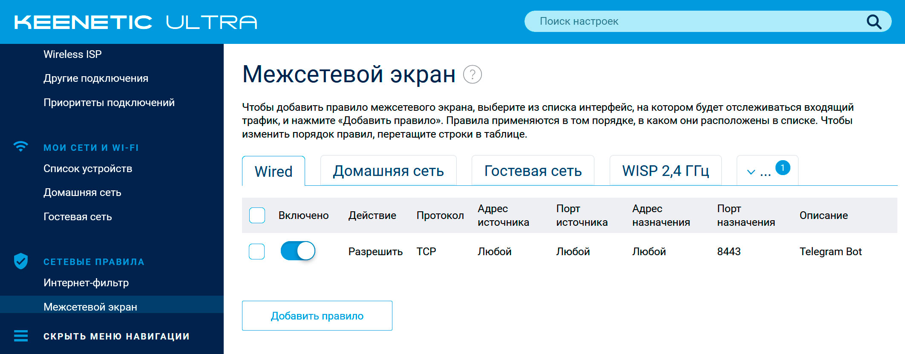

# xkeen-tg


[](https://github.com/arabezar/xkeen-tg/releases)
[](https://github.com/arabezar/xkeen-tg/stargazers)
[](LICENSE)
[](https://yoomoney.ru/to/410013875426872)
[](https://pay.cloudtips.ru/p/6352cb45)
[](https://t.me/xkeen_tg)

Инструмент (ограниченного) управления маршрутизатором и конфигурацией утилиты `XKeen` для роутеров через Telegram бота. Написан исключительно на `shell` (`bash`), но, разумеется, использует пакеты `Entware`. Весь код полностью открыт и доступен для изучения. Команды бота выполнены в виде плагинов

Предназначен для роутеров Keenetic/Netcraze с [установленным](https://help.keenetic.com/hc/ru/articles/360021214160-Установка-системы-пакетов-репозитория-Entware-на-USB-накопитель) [Entware](https://github.com/Entware/Entware) и [XKeen](https://github.com/Skrill0/XKeen).
> [!TIP]
> Теоретически инструмент может работать на любой связке `Entware` и `xray`, если будут предложения и необходимость, можно попробовать реализовать, обсуждения можно вести в [Discussions](https://github.com/arabezar/xkeen-tg/discussions/categories/ideas) и [Телеграм-канале](https://t.me/xkeen_tg)

> [!IMPORTANT]
> Данный материал подготовлен в научно-технических целях.
> Использование предоставленных материалов в целях отличных от ознакомления может являться нарушением действующего законодательства.
> Автор не несет ответственности за неправомерное использование данного материала.

> [!WARNING]
> **Вы пользуетесь этой инструкцией на свой страх и риск!**
> 
> Автор не несёт ответственности за порчу оборудования и программного обеспечения.

## Предварительные требования

- Белый IP для Telegram Webhook
- Зарегистрированный бот Telegram с возможностью настройки webhook
- Роутер Keenetic с установленным XKeen (требуется root доступ)
> [!IMPORTANT]
> Установщик определяет ваш внешний IP-адрес (сначала средствами роутера, если не получается - обращаясь к https://ifconfig.me) для дальнейшего определения страны, региона и города для CSR при выпуске самоподписанного сертификата, а также регистрации бота в Телеграм.

> [!TIP]
> Для определение страны, региона и города для CSR установщик использует внешние ресурсы, используя функции, выделенные в отдельный модуль `ip2geo.sh`. Если роутер подключён через VPN, то полученная от внешних ресурсов информация будет неверной, однако установщик позволяет переопределить страну, регион и город в момент установки. Также сервисы из `ip2geo.sh` могут ошибаться при определении региона и города даже по валидному ip-адресу. Если вы столкнулись с подобным поведением, у вас есть возможность сразу поправить параметры вводом корректных значений или, если у вас есть время, и вы чувствуете зуд перфекциониста 😊, можно прервать установку по `Ctrl+C` в момент сбора информации (как раз на ошибочно определённых регионе и городе), и запустить тестирование сервисов командой `./tools/ip2geo_test.sh`, выбрать наиболее подходящий, скорректировать его в функции `get_geo_info` (в самом низу модуля) `ip2geo.sh`, после чего вновь запустить установщик командой `./install_xktg.sh --renew` (`--renew` используется только для обновления сертификата и всего, что с ним связано, остальная функциональность установщика не меняется) и продолжить установку `xkeen-tg`

  <details>
  <summary>Пример тестирования доступности сервисов</summary>
  
  ```sh
  root@router:~/xkeentg$ ./tools/ip2geo_test.sh
  Время доступа для ipwho.is: 10 мс
      Страна: RU, Регион: Moscow Oblast, Город: Zagornovo
  Время доступа для api.sypexgeo.net: 10 мс
      Страна: RU, Регион: Moskva, Город: Moscow
  Время доступа для ipinfo.io: 20 мс
      Страна: RU, Регион: Moscow, Город: Moscow
  Время доступа для ipapi.co: 2 мс
      Страна: RU, Регион: Moscow Oblast, Город: Imeni Tsyurupy
  Время доступа для ipapi.is: 43 мс
      Страна: RU, Регион: Москва, Город: Moscow
  ```
  </details>

## Установка на роутер

> [!IMPORTANT]
> Телеграм для webhook умеет слать на `80`, `88`, `443` и `8443` порты, [другие не поддерживаются](https://core.telegram.org/bots/webhooks). На роутере необходимо открыть порт вручную, возможно в будущих версиях установщик сможет это делать сам

- Открыть на роутере внешний порт `8843` на прослушивание (на примере роутера `Keenetic Ultra II`)

  <details>
  <summary>Открытие порта через GUI (вэб-конфигуратор)</summary>
  
  В разделе `Безопасность (Security) → Фаервол (Firewall)`, у меня это - `Сетевые правила → Межсетевой экран' → Wired (интерфейс от провайдера)`, добавить и включить правило `Telegram Bot` (`Действие`=`Разрешить`, `IP-адрес источника`=`Любой`, `IP-адрес назначения`=`Любой`, `Номер порта источника`=`Любой`, `Протокол`=`TCP`, `Номер порта назначения`=`8443` (один из указанных выше))
  </details>

  <details>
  <summary>Результат открытия порта 8443</summary>

  
  </details>

- Находясь в домашней папке (или ещё лучше - создав в ней подпапку `xkeentg` и перейдя в неё, чтоб не мусорить) загрузить скрипт, подгружающий и запускающий последнюю версию скрипта установки:
  ```sh
  curl -sLO https://raw.githubusercontent.com/arabezar/xkeen-tg/main/install_xktg.sh && chmod +x install_xktg.sh && ./install_xktg.sh
  ```
- Заполнить все запрашиваемые параметры, `Enter` - подтвердить значение в квадратных скобках.
> [!TIP]
> Если параметр, являющийся обязательным для заполнения, не задан, например, в результате нажатия на `Enter`, то скрипт попросит ещё раз заполнить параметр, и так будет продолжаться до ввода параметра.

> [!TIP]
> Если нажата комбинация `Ctrl-C`, скрипт прервёт установку, однако её можно возобновить повторным запуском `./install_xktg.sh`, подтвердив все уже записанные значения или изменяя необходимые

- После ввода и сохранения параметров скрипт автоматически начнёт процедуру установки утилиты `xkeen-tg` на роутер, дождитесь завершения установки и перезагрузите роутер (не обязательно)

</details>
<details>
<summary>Пример лога</summary>

```sh
root@router:~/xkeentg$ curl -sLO https://raw.githubusercontent.com/arabezar/xkeen-tg/main/install_xktg.sh && chmod +x install_xktg.sh && ./install_xktg.sh
Установка xkeen-tg 0.1.5...
Загрузка и распаковка xkeen-tg...
Поиск настроенного socks5...
Сбор параметров для установки...
Код страны [RU] (Enter - подтвердить):
Регион или область [Moscow] (Enter - подтвердить):
Город [Moscow] (Enter - подтвердить):
Организация [Home] (Enter - подтвердить):
Подразделение [IT] (Enter - подтвердить):
Домен для сертификата: tg.example.com
Путь к сертификатам [/opt/etc/tg] (Enter - подтвердить):
Токен вашего бота Телеграм: 1234567890:GK68NKLklJ_sdkjbkjbRJKGbhbsaJH67Bkk
Список валидных пользователей (id через пробел): 123456789 987654321
Внешний порт для webhook бота Телеграм [8443] (Enter - подтвердить):
Локальный порт для работы бота Телеграм [8444] (Enter - подтвердить):
Локальный порт для работы прокси [1080] (Enter - подтвердить):
Внешний ip-адрес роутера [123.45.67.89] (Enter - подтвердить):
Внутренний ip-адрес роутера [192.168.1.1] (Enter - подтвердить):
Настройка socks5...
XKeen перезапущен
Обновление Entware...
Установка необходимых пакетов (openssl-util, lighttpd, netcat)...
Выпуск сертификата (CSR: /C=RU/ST=Moscow/L=Moscow/O=Home/OU=/CN=tg.example.com)...
Настройка модулей web-сервера...
Starting lighttpd...              done.
Starting tgbotd...              done.
Checking lighttpd...              alive.
Checking tgbotd...              alive.
Регистрация webhook в Телеграме...
✅ Регистрация webhook прошла успешно: Webhook was set
✅ Установка завершена
root@router:~/xkeentg$
```
</details>

### Действия и описание параметров установки

При установке скрипт последовательно выполняет следующие действия:
- Проверяет наличие `Entware` и `XKeen`, а также совместимость с версией последней для установки `xkeen-tg`
- Скачивает и распаковывает в текущую папку файлы последнего релиза `xkeen-tg`
- Запрашивает параметры установки у пользователя и сохраняет их в конфигурационном файле `/opt/sbin/.xkeentg/.env`, в том числе:
  - Информация (CSR) для выпускаемого самоподписываемого сертификата для регистрации webhook бота Телеграм: `Код страны`, `Регион или область`, `Город`, `Организация`, `Подразделение`
    > Можно оставить эти параметры по умолчанию, они ни на что не влияют, параметры будут видны в самом сертификате при открытии, если это вообще когда-либо случится 😊. В начале данной страницы описано, как получаются параметры и как улучшить их определяемость по ip-адресу. Если кто хочет подискутировать на эту тему и не только, милости прошу в [Discussions](https://github.com/arabezar/xkeen-tg/discussions/categories/ideas) и/или [Issues](https://github.com/arabezar/xkeen-tg/issues), а также [Телеграм-канал](https://t.me/xkeen_tg)

  - `Домен для сертификата`
    > Этот параметр должен строго соответствовать домену, на который будет регистрироваться webhook бота Телеграм, впоследствии бот будет общаться с роутером через этот домен. _Пример:_ `tg.example.com`. Динамические домены не пробовал, пробуйте сами, делитесь опытом в [Discussions](https://github.com/arabezar/xkeen-tg/discussions/categories/general) и [Телеграм-канале](https://t.me/xkeen_tg)

  - `Путь к сертификатам` - это путь по которому в роутере будет храниться вновь выпущенный сертификат с приватным ключём, можно оставить по умолчанию.
    > Выпущенный роутером сертификат будет использоваться как ботом Телеграм, так и вэб-сервером для безопасного соединения обоих между собой, поэтому удалять их из папки не рекомендуется

  - `Токен вашего бота Телеграм`, выдаётся ботом Телеграма `@BotFather` при регистрации вашего бота. Описывать регистрацию бота здесь смысла не имеет, описаний полно в интернетах
    > Данный токен используется не только для регистрации webhook бота на роутере, но и для ответа вашего бота Телеграмму, а также как виртуальная папка вэб-сервера на роутере, на которую Телеграм шлёт команды для обработки, таким образом увеличивая защиту вашего роутера,... ведь даже если злоумышленникам известен домен бота роутера, не зная токена они не смогут получить контроль над ботом, т.к. любые попытки отправки команд боту на известный домен роутера будут пресечены вэб-сервером и не достигнут бота

  - `Список валидных пользователей (id через пробел)` - идентификаторы (`chat_id`) пользователей, которые имеют доступ к управлению вашим роутером. Любой из пользователей имеет одинаковые права. _Пример_: `123456789 987654321 135790864`. Как узнать идентификатор пользователя ищите в интернетах, описаний полно

  - `Внешний порт для webhook бота Телеграм` - входящий порт для прослушивания на роутере, куда приходят сообщения от пользователей Телеграма, можно оставить по умолчанию, если не занят на роутере
    > Телеграм для webhook умеет слать на `80`, `88`, `443` и `8443` порты, [другие не поддерживаются](https://core.telegram.org/bots/webhooks). На роутере необходимо открыть порт вручную (см. самый первый пункт установки), возможно в будущих версиях установщик сможет это делать сам

  - `Локальный порт для работы бота Телеграм` - прокси-порт для бота на роутере, который будет обрабатывать команды. Может быть любым незанятым портом на роутере, используется вэб-сервером роутера для проксирования запросов от Телеграма на бот обработчика команд

  - `Локальный порт для работы прокси` - прокси-порт для роутера, который будет использоваться для отправки запросов через VPS, а не напрямую через провайдера, а также для получения IP-адреса VPS (как исталлятором, так и командой `/status` бота), получения geo-данных для регистрации сертификата и т.д.

  - `Внешний ip-адрес роутера` - адрес, используемый для регистрации бота в Телеграм

  - `Внутренний ip-адрес роутера` - адрес, используемый для отображения страницы вэб-сервера в локальной сети

- Настраивает прокси для внутреннего использования (при необходимости)
  > Во время установки в конфигурацию `xray` добавляются два блока `socks` в `inbounds` и `routing.rules`. Оригинальные файлы копируются в папку `.xkeentg` с расширением `.bak`. Если блоки уже существуют, запрос порта не выводится и далее используется указанный в блоке `inbounds` порт, бэкап файлов не производится. Если по каким-либо причинам перезагрузка сервиса `XKeen` с новыми конфигурационными файлами не приводит к нормальной загрузке, изменённые конфигурационные файлы восстанавливаются, а установка прерывается с ошибкой

- Обновляет список состава и версий `Entware`, это действие позволяет загрузить стабильные пакеты последних версий

- Обновляет уже установленные пакеты `Entware` новыми версиями
  > Сложно сказать, необходимо ли обновлять уже установленные версии пакетов `Entware` или нет, но я у себя обновил, проблем не заметил. На всякий случай я закомментировал команду обновления уже установленных пакетов `Entware` в установщике, но могу в следующей версии либо включить эту возможность безусловно, либо по дополнительному запросу установщика. Предложения прошу писа́ть в [Discussions](https://github.com/arabezar/xkeen-tg/discussions/categories/general) и [Телеграм-канале](https://t.me/xkeen_tg)

- Устанавливает необходимые для `xkeen-tg` пакеты:
  - `openssl-util` - для выпуска самоподписываемого сертификата
  - `lighttpd` - очень лёгкий вэб-сервер с дополнительными модулями `mod-setenv, mod-openssl, mod-proxy, mod-rewrite` для защищённого обмена роутера и Телеграм
  - `netcat` - инструмент для обмена данными бота и Телеграма, работающий как ещё более лёгкий и быстрый незащищённый вэб-сервер через защищённый проксирующий вэб-сервер `lighttpd`

- Выпускает самоподписанный сертификат (если необходимо) сроком на 10 лет
  > Установщик проверяет, был ли ранее выпущен сертификат, и была ли введена команда на перевыпуск (`./install_xktg.sh --renew`). Если сертификат найден в указанной пользователем папке и команда на перевыпуск не подавалась, выпуск сертификата пропускается

- Конфигурирует веб-сервер в соответствии с указанными пользователем параметрами и сохраняет конфигурацию веб-сервера в папке `/opt/etc/lighttpd/conf.d`

- Копирует вспомогательные файлы вэб-сервера (статичные вэб-страницы - главная и ошибок) в корневую папку вэб-сервера `/opt/share/www`
  > 🌍 Любая страница, кроме папки токена, (https://tg.example.com:8443/bla-bla) открытая в интернете вызовет вывод страницы с ошибкой

  > 🔒 Страница с папкой токена (https://tg.example.com:8443/_token_), которую никто кроме вас не знает, перебрасывает вас на обработчик команд Телеграма
  
  > 🏠 Главная страница сайта (https://192.168.1.1:8443), открытая в локальной сети вызовет вывод страницы со ссылкой на проект, тогда как любая другая несуществующая страница с любой папкой (https://192.168.1.1:8443/bla-bla) вызовет вывод страницы ошибки

- Копирует исполняемые файлы инструмента `xkeen-tg` (`tgbotd`, `xkeentg`) в системную папку `/opt/sbin`

- Регистрирует инструмент в автозагрузке (`S99xkeentg`)

- Запускает вэб-сервер и бот Телеграм

- Регистрирует webhook на роутер в Телеграм

## Удаление

- Находясь в домашней папке (или создав в ней подпапку `xkeentg` и перейдя в неё, чтоб не мусорить) загрузить скрипт, подгружающий и запускающий последнюю версию скрипта установки:
  ```sh
  curl -sLO https://raw.githubusercontent.com/arabezar/xkeen-tg/main/remove_xktg.sh && chmod +x remove_xktg.sh && ./remove_xktg.sh
  ```
- На все вопросы отвечать одной клавишей - Y|N или на киррилице Д|Н, `Enter` = N|Н
> [!NOTE]
> Если отрицательно ответить на первый вопрос, скрипт не будет ничего делать и прекратит исполнение. Иначе начнётся удаление `xkeek-tg`, перед каждым действием будет задан уточняющий вопрос. Итак, далее идут остановка сервисов с отображением статусов, удаление конфигурационных файлов, удаление регистрации бота в Телеграм, удаление выпущенных сертификатов, инструментов `netcat`, вэб-сервера `lighttpd`, инструментов для выпуска сертификата. От удаления настроек бота, выпущенного сертификата можно отказаться, если планируется в дальнейшем повторно устанавливать `xkeen-tg`, тогда при переустановке параметры и сертификат будут подхвачены установщиком. Также можно отказаться от удаления инструментов `netcat`, `openssl-util` и вэб-сервера `lighttpd`, если планируется использование их в других проектах, т.е. на данном этапе установщик нигде не сохраняет информацию, какие модули `Entware` он установил, а какие были установлены до него. Блоки `socks` конфигурационных файлов `xray` автоматически не удаляются, их можно либо оставить, либо удалить самим, либо послностью восстановить файлы из бэкап-версий из папки `.xkeentg`, если конфигурация не менялась

</details>
<details>
<summary>Пример лога</summary>

```sh
root@router:~/xkeentg$ curl -sLO https://raw.githubusercontent.com/arabezar/xkeen-tg/main/remove_xktg.sh && chmod +x remove_xktg.sh && ./remove_xktg.sh

root@router:~/xkeentg$
```
</details>

## Использование

* `xkeen-tg` управляется из терминала, вот его список команд, который можно получить запустив его без параметров:
  ```text
  Основные команды:
    --start       - запуск
    --stop        - останов
    --restart     - перезапуск
    --status      - состояние
    --version     - версия

  Вспомогательные команды:
    --test        - информация о запущенных процессах
    --clean       - избавление от проблем (только в случае проблем со службами)
    --renew-telegram-commands     - обновить команды Телеграм
  ```
* Все пользовательские команды исполняются из Телеграма.
  Краткую помощь по списку команд можно получить непосредственно в Телеграме через меню.
* Команды разрешено выполнять только зарегистрированным пользователям, прописанным в настройках скрипта `.env`, другим пользователям бот не отвечает
* Полный список команд управления службой `XKeen` роутера с кратким описанием:
  ```text
  <none-of-below>          - список команд роутера
  /domain check <domain>   - проверить статус домена в конфигурационных файлах
  /domain add <domain>     - добавить домен в конфигурацию (+ перезагрузка)
  /domain del <domain>     - удалить домен из конфигурации (+ перезагрузка)
  /domain comment <domain> - закомментировать (деактивировать) домен в конфигурации (+ перезагрузка)
  /status [uptime xkeen xray db ip] - показать статус роутера и службы (статус, текущая и последняя версии xkeen, текущая и последняя версии xray, версии баз данных, внешние IP-адреса роутера)
  /key [<url>]             - обновить, если указан url, параметры соединения в конфигурации (+ перезагрузка), в ответе - заменённый URL с датой в комменте, иначе - показать url текущей конфигурации
  /restart                 - перезагрузить службу
  
  можно использовать алиасы субкоманд:
  /domain . <domain>       - проверить статус домена в конфигурационных файлах
  /domain + <domain>       - добавить домен в конфигурацию (+ перезагрузка)
  /domain - <domain>       - удалить домен из конфигурации (+ перезагрузка)
  /domain # <domain>       - закомментировать (деактивировать) домен в конфигурации (+ перезагрузка)
  ```
  <details>
  <summary>Пример лога команды /status</summary>

  ```text
  ⚡️ Роутер работает (дней): 13
  💡 Текущая загрузка: 2.81, 2.80, 2.73
  🛡 XKeen 1.1.3 (git: 1.1.3) запущен ✅
  🧩 Xray 25.3.6 (git: v25.3.31)
  📦 v2fly: 20250407044718 / 202504122211
  📦 zkeen: 250412 / 250412
  👣 IP host: 123.45.67.89 🇷🇺(Russia)
  👣 IP VPS: 213.123.78.21 🇩🇪(Germany)
  ```
  </details>
> [!WARNING]
> В связи с тем, что формат конфигурационных файлов `xray` содержит комментарии, не поддерживаемые классическим `json`, обработка файлов (для команд `/domain` и `/key`) производится текстовыми средствами оболочки, очень сильно зависящими от шаблонов поиска/замены, поэтому во-первых, старайтесь придерживаться формата конфигурационных файлов при инсталляции `XKeen`, а во-вторых, при возникновении ошибок, сразу пишите в [Issues](https://github.com/arabezar/xkeen-tg/issues) или [Discussions](https://github.com/arabezar/xkeen-tg/discussions), а также [Телеграм-канал](https://t.me/xkeen_tg), поправим как можно быстрее
* Команды можно добавлять самому, для этого необходимо создать файл с расширением `tg` по шаблону ниже и положить его в папку `/opt/sbin/.xkeentg`, после чего (при желании) обновить меню команд Телеграм командой `xkeentg --renew-telegram-commands`
  ```sh
  # описание команды
  cmd_description="Краткое описание команды" # будет видно в Телеграм по клавише menu"
  cmd_parse_mode="" # режим для ответа для текущей команды: <пусто> или один из HTML, MarkdowsV2, Markdown

  cmd_help() {
      # входящими параметрами является строка сообщения пользователя
      # желательно хотя бы раз упомянуть $1 (т.е. саму команду), иначе не будет понятно, к какой команде относится описание
      local _cmd="$1"
      echo "$_cmd - описание варианта использования команды"
      echo "  может описывать подкоманды и быть многострочным"
  }

  cmd_run() {
      # Реализация команды должна вернуть результат в стандартный поток оболочки
      # Если ничего не отображает, команда в Телеграме отработает без ответа
      local _some_var="Вывод команд"
      echo "$_some_var"
  }
  ```
> [!TIP]
> Файл команды как минимум должен содержать указанные структуры (переменную `cmd_description`, `cmd_parse_mode` и функции `cmd_help`, `cmd_run`), пусть даже пустые. Старайтесь, чтобы имена ваших вспомогательных функций не пересекались с функциями `xkeentg`, иначе это может привести к непредсказуемым результатам. Рекомендуется, например, использовать имена функций, начинающиеся с символа подчёркивания `_`. Также делитесь идеями и командами в [Discussions](https://github.com/arabezar/xkeen-tg/discussions/categories/ideas) и [Телеграм-канале](https://t.me/xkeen_tg)

## Вклад

Все идеи, пожелания и замечания категорически приветствуются в разделах [Issues](https://github.com/arabezar/xkeen-tg/issues), [Discussions](https://github.com/arabezar/xkeen-tg/discussions), а также [канале](https://t.me/xkeen_tg) Телеграм.

---

Нравится проект? Поддержи автора, купи ему :beers: или :coffee: ([тынц](https://yoomoney.ru/to/410013875426872) или [тынц](https://pay.cloudtips.ru/p/6352cb45))
